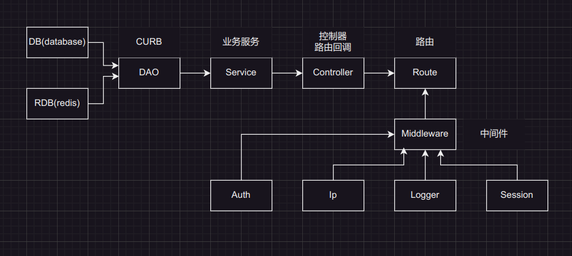

## Miner

### 项目结构

```sh
├── assets            # 资源文件，无关项目
├── cmd               # 简化 main，暂不处理
├── common            # 分离出来的一些模块，使其他模块专注自身职责
│   ├── dto           # 数据对象，request
│   ├── perm          # 基础权限信息
│   ├── points        # 积分类型信息
│   ├── rsp           # response
│   └── status        # 状态信息
├── controller        # 控制器
├── dao               # 数据访问对象
│   ├── mysql         # 数据库访问对象
│   └── redis         # redis 访问对象
├── logs              # 日志文件夹
├── middleware        # 中间件
├── model             # 数据库模型
├── route             # 路由
├── service           # 业务服务
├── utils             # 其他模块（乱七八糟的模块）
│   ├── captcha.go    # 验证码
│   ├── config.go     # 读配置，有一个全局 Config 变量
│   ├── invitecode.go # 生成邀请码，暂且使用 UUID
│   ├── jwt.go        # jwt token 验证
│   ├── logger.go     # 本地日志
│   ├── mysql.go      # 全局 DB，单例初始化
│   └── redis.go      # 全局 RDB，单例初始化
├── config.yml        # 配置文件
├── go.mod            # go module
├── main.go           # 程序入口
└── README.md         # README
└── API.md            # API 文档 
```

模块调用流程：



### 运行

```sh
go mod tidy
go run ./main.go
```

`redis-cluster` 目录为 持久化的分布式 redis

### TODO

- rdb
- 充值
- 传输数据加密
- 用户创建上限(内存空间)
- 单元测试，压力测试
- ...
